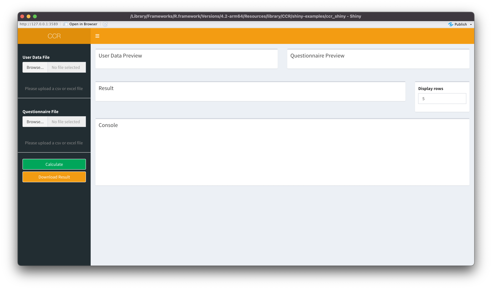
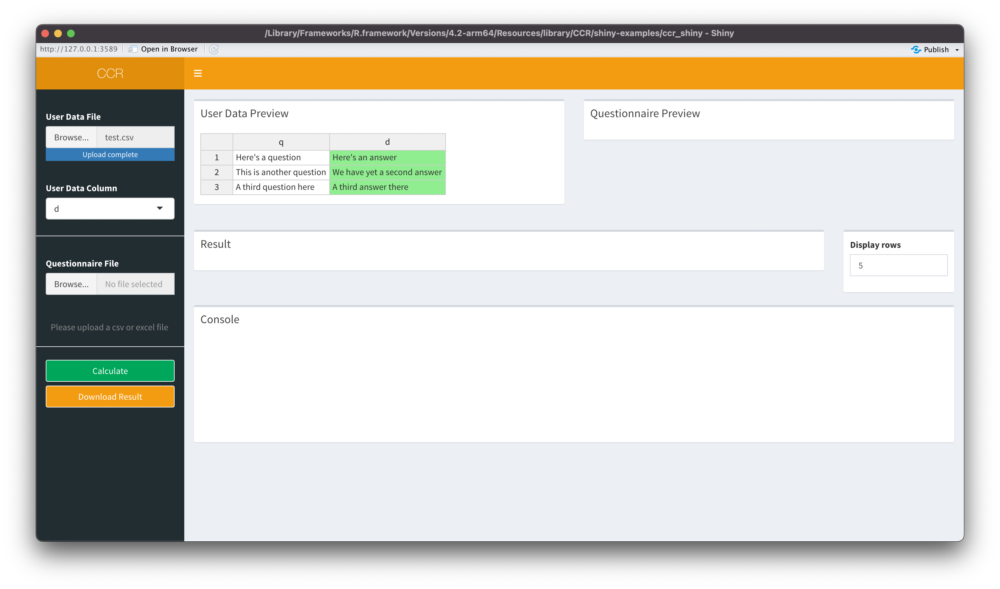
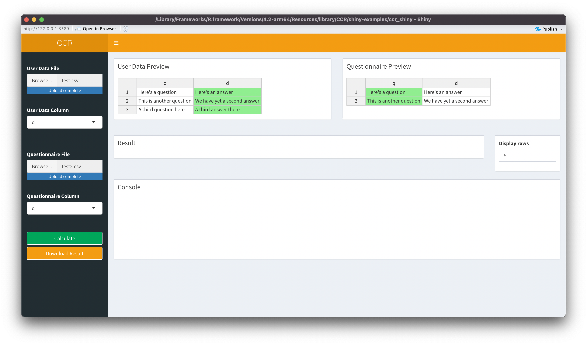
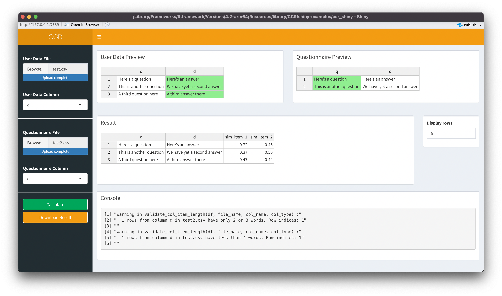

<!-- README.md is generated from README.Rmd. Please edit that file -->

```{r, include = FALSE}
knitr::opts_chunk$set(
  collapse = TRUE,
  comment = "#>",
  fig.path = "man/figures/README-",
  out.width = "100%"
)
```

# Contextualized Construct Representations (CCR)

<!-- badges: start -->
<!-- badges: end -->


## Introduction

This package is an implementation of our new method for theory-driven psychological text analysis named Contextualized Construct Representations (CCR). For more information, read the preprint or email Mohammad Atari [matari@fas.harvard.edu]. Here, we will briefly outline how CCR works; its implementation can be summarized in 5 steps as follows:

1. Specify a psychological construct of interest that needs to be measured in textual data (e.g., individualism).

2. Select a psychometrically validated self-report measure for the construct of interest (e.g., The 6-item Individualism Scale).

3. Represent self-report items as embeddings using contextualized language models (e.g., BERT).

4. Represent the text to be analyzed using contextualized language models (e.g., BERT).

5. Compute the similarity between the representation of text and those of psychometric scale items (e.g., using cosine similarity) to arrive at a set of “loading” scores. The higher this similarity, the higher the text scores on the construct of interest.


## Installation

The original functions for CCR were implemented. This is a direct translation into R using the following packages: tidyverse (data manipulation), lsa (cosine similarity), and huggingfaceR (modeling). You can install the development version of CCR from [GitHub](https://github.com/) with:

``` r
# install.packages("devtools")
devtools::install_github("tomzhang255/CCR")
```

Note that this package automatically installs Miniconda and
<https://github.com/farach/huggingfaceR> in the background.


## Usage

Here is a simple example of how to use the main function:

```{r include=FALSE}
library(CCR)
```

```{r example}
res <- ccr_wrapper("inst/extdata/d.csv", "d", "inst/extdata/q.csv", "q")
res
```

In particular, “data/d.csv” is the path (the complete address, absolute or relative, including .csv; in this case, the file resides in the root directory of our R project, so “data/d.csv” is the relative path) to the file containing text data to be analyzed (e.g., user response to the questionnaires; this could be open-ended text or tweets). This function supports excel files as well (.xls, .xlsx). “d” would then be the name corresponding to the column in “data/d.csv” containing said data. Similarly, “data/q.csv” is the file path for the questionnaire (i.e., the validated psychometric scale to use). And “q” would be the column in “data/q.csv” that contains these questionnaire items. Note that the file names can also be substituted with R data frame objects, if the user has already imported their data.

The output of the function is a data frame of identical structure as “data/d.csv” but with a few extra columns appended. The number of these extra columns equals the number of questionnaire items. The values of the columns are cosine similarity scores between each text item and questionnaire item.

By default, the function uses the language model named “all-MiniLM-L6-v2” (Wang, Wenhui, et al., 2020); however, the user can specify any model of their choice with the “model” argument in ccr_wrapper(). See a complete list of all possible models on <https://huggingface.co/models>.


## Shiny App

Additionally, one can call the function `ccr_shiny()` to launch a Shiny app locally and perform the same operations on a more user-friendly interface.

```{r eval=FALSE}
ccr_shiny()
```

Figure 1 below is what a user might see upon launching the Shiny app:



In the left sidebar, click on the first “Browse” button to upload the user data file (this corresponds with “d.csv” in the previous example). Note that a dropdown menu appears after the file upload; use it to select the appropriate column containing the actual user response (the “d” column). Upon finishing, the state of our Shiny app should resemble Figure 2 below.




Repeat the process to load in our questionnaire data using the second “Browse” button, then select the desired column (Figure 3).



Click on the “Calculate” button in the sidebar to execute the CCR process. Now, in the main panel we see a resulting data frame (see Figure 4).



This is the exact same output as one would get using the function `ccr_wrapper()`. The console section displays any warnings or errors upon executing `ccr_wrapper()`. The “Display rows” controller lets the user limit the rows in the output to display. Furthermore, by clicking on the “Download Result” button in the sidebar, one can download the complete result data frame.


## References

Wang, Wenhui, et al. "Minilm: Deep self-attention distillation for task-agnostic compression of pre-trained transformers." Advances in Neural Information Processing Systems 33 (2020): 5776-5788.
